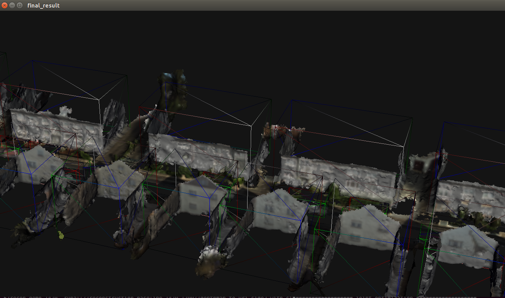

# Similarity Reconstruction
Objects of similar types and shapes are common in urban areas. In this project we take advantage of this observation to improve the quality of 3D reconstruction. Similarly shaped objects are located using detectors and then jointly reconstructed by learning a volumetric model. By aggregating observations from multiple instances, the completeness of reconstruction can be improved and noise can be suppressed.

### Related Paper
* **Exploiting Object Similarity in 3D Reconstruction**, *Chen Zhou, Fatma Güney, Yizhou Wang , Andreas Geiger*, ICCV '15

# 1. Prerequisites
The code is written and tested under Ubuntu 14.04.3. The following libraries are required:

  1.  Boost (>=1.54)
  2.  PCL (>=1.7)
  3.  OpenCV (>=2.4.6)
  4.  Eigen (>=3.2.4)
  5.  [Ceres solver](http://ceres-solver.org/) (>=1.10)
  6.  [Glog](https://github.com/google/glog)

Installing prerequisites:

```
sudo apt-get install libboost-all-dev libopencv-dev libgoogle-glog-dev 
```
  - Eigen: The eigen package in the ubuntu 14.04 repository is 3.2.0. It's recommended to download a newer version of Eigen from its [website](http://eigen.tuxfamily.org/index.php?title=Main_Page).

  - Ceres-solver: The library and instructions for installing can be donwloaded from [source](http://ceres-solver.org/).

  - [Point Cloud Library](http://pointclouds.org/downloads/linux.html): 
  ```
  sudo add-apt-repository ppa:v-launchpad-jochen-sprickerhof-de/pcl
  sudo apt-get update
  sudo apt-get install libpcl-all
  ```

# 2. Compile
Download the project:

```sh
git http://cvlibs.net:3000/ageiger/similarity_reconstruction.git similarity_reconstruction
```

Compile the code:

```sh
cd similarity_reconstruction/code/similarity_reconstruction
cmake .
make
```

Compile the mesh viewer for visualizing the results (optional).

```
cd similarity_reconstruction/code/similarity_reconstruction/visualization/trimesh2
make
```
Note that the output ply files can be directly viewed in Meshlab, Cloudcompare, etc.

# 3. Run
Several bash scripts in `similarity_reconstruction/code/similarity_reconstruction/demo_scripts/` are used to run the code.
To run the demos one needs to download and untar a package containing the training files and initial 3D reconstruction  from [here](https://drive.google.com/file/d/0By1iH4kzxY79WWtxSHFQM0syRVk/view?usp=sharing).
* Running `demo.sh`: the demo script will run detection and joint reconstruction using pretrained detectors and the initial 3D reconstruction.
  1. Set the follwing variables in `init_paths_samples.sh` and rename it to `init_paths.sh`:

       -`$bin_dir`: the folder for the built binaries.

       -`$result_root`: the folder for storing results.

       -`$mesh_view_bin`: the binary file for the mesh viewer (optional).

       -`$demo_data_root`: the folder for the downloaded files containing training files and initial 3D reconstruction.

  2. Run `demo.sh`.

* Running `run_all.sh`: the scripts runs the whold pipeline, including initial 3D reconstruction from image sequence, detector training, detection and joint optimization.
  1. Set the follwing variables in `init_paths_samples.sh` and rename it to `init_paths.sh`:

     -`$data_root_dir`: the root folder for the image sequences

     -Multiple `*prefix` variables: specify the paths for camera parameters, image sequences, depth maps and sky labeling maps

     -`$bin_dir`: the folder for the built binaries.

     -`$result_root`: the folder for storing results.

     -`$mesh_view_bin`: the binary file for the mesh viewer (optional).

     -`$demo_data_root`: the folder for the downloaded pretrained detectors and initial 3D reconstruction.

  2. Run `run_all.sh`.



